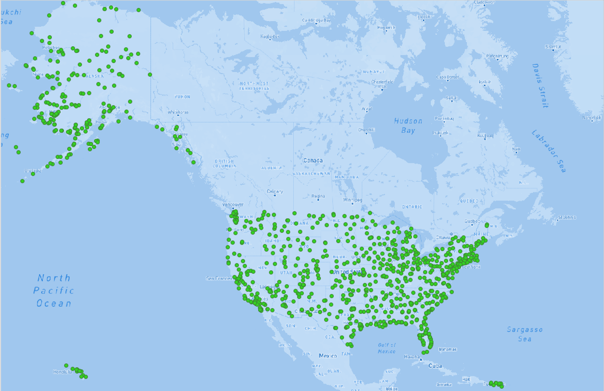

# Lab 04: Mapbox and QGIS tiles

This project generated small scale map tiles of Airport in the United States data. The base map has been generated through MapBox and the tiles have been generated using QMetaTiles plugin in QGIS.
Map tiles are 256 by 256 pixel images that help in generating visually apealing, creative maps that help users to gain geographical information of different places.
I used geographical location data of Airports in the United States to create these tiles. These tiles when put together using the code in tindex file will create a visually pleasent map of airports in the US.
I chose airport data since it was easily available and was helpful to various user groups.
I used the Zoom level of 0 to 5 to generate these tiles so I obtain a clear map image and minimize the amount of png tile files to be created and uploaded to the github repository.
